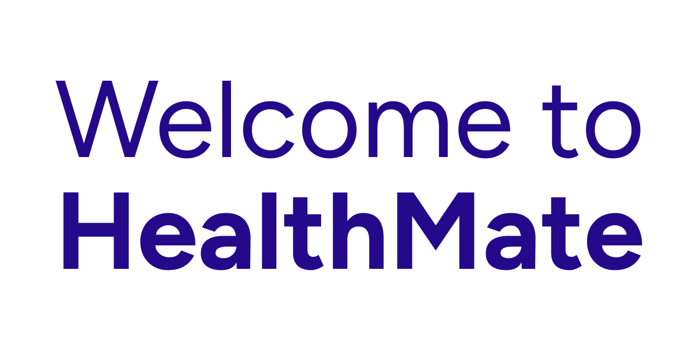

# HealthMate

HealthMate is a comprehensive health management application designed to help users track appointments, manage crises, and monitor exams. The project consists of a Django backend (REST API) and a React Native frontend (Expo), with additional support for Retrieval-Augmented Generation (RAG) features.

## Project Structure

```
HealthMate/
│
├── app/                # React Native (Expo) frontend
│   ├── app/            # Main app screens and navigation
│   ├── components/     # Reusable UI components
│   ├── services/       # API service modules
│   └── ...             # Config, assets, etc.
│
├── backend/            # Django backend (REST API)
│   ├── appointments/   # Appointments app
│   ├── crisis/         # Crisis management app
│   ├── exams/          # Exams tracking app
│   ├── users/          # User management
│   ├── healthmate/     # Project settings and URLs
│   └── ...             # Database, media, etc.
│
├── rag_groq/           # Retrieval-Augmented Generation (RAG) module (Groq LLM integration)
│   ├── app.py          # Main FastAPI app for RAG API
│   ├── modules/        # RAG pipeline, ingestion, and answer generation scripts
│   ├── guideline_index/# FAISS and pickle index files for document retrieval
│   ├── docs/           # Data and reference documents for RAG
│   ├── requirements.txt# Python dependencies for RAG API
│   └── ...             # Scripts, notebooks, and other RAG-related files
│
└── docs/               # Documentation, diagrams, and mockups
```

---

## Backend Setup (Django)

1. **Install Python 3.11+** and pip if not already installed.

2. **Create and activate a virtual environment:**

   ```sh
   python -m venv venv
   # On Windows:
   venv\Scripts\activate
   # On macOS/Linux:
   source venv/bin/activate
   ```

3. **Install dependencies:**

   ```sh
   pip install -r backend/requirements.txt
   ```

4. **Apply migrations:**

   ```sh
   cd backend
   python manage.py migrate
   ```

5. **Run the development server:**
   ```sh
   python manage.py runserver 0.0.0.0:8000
   ```

---

## Frontend Setup (React Native with Expo)

1. **Install Node.js (v18+) and npm.**

2. **Install Expo CLI globally:**

   ```sh
   npm install -g expo-cli
   ```

3. **Install dependencies:**

   ```sh
   cd app
   npm install
   ```

4. **Create a `config.ts` file under `app/app`**

   ```ts
   // config.ts
   export const SERVER_URL = "http://{your_server_ip}:8000";
   ```

   If you're running the backend locally, replace `{your_server_ip}` with your local IP address (e.g., `http://192.168.1.1:8000`).

5. **Start the Expo development server:**

   ```sh
   npm start
   ```

   or

   ```sh
   expo start
   ```

6. **Run on your device:**
   - Use the Expo Go app (iOS/Android) to scan the QR code.
   - Or run on an emulator/simulator.

---

## RAG Module (Groq LLM Integration)

The `rag_groq` folder contains a Retrieval-Augmented Generation (RAG) API powered by Groq LLM. This module enables advanced question answering and document retrieval features for HealthMate, leveraging local document indexes and large language models.

### Structure

- `app.py`: FastAPI app exposing RAG endpoints.
- `modules/`: Core logic for ingesting documents, building indexes, and generating answers.
- `guideline_index/`: FAISS and pickle files for fast document retrieval.
- `docs/`: Source documents used for RAG.
- `requirements.txt`: Python dependencies for the RAG API.
- `test.ipynb`: Example notebook for testing the RAG pipeline.

### Usage

1. **Install dependencies:**

   ```sh
   cd rag_groq
   pip install -r requirements.txt
   ```

2. **Configure environment variables:**

   Create a `.env` file in the `rag_groq` directory with the following content:

   ```env
   GROQ_API_KEY=your_groq_api_key
   ```

   Replace `your_groq_api_key` with your actual Groq API key.

3. **Run the RAG API server:**

   ```sh
   uvicorn app:app --reload --port 8001
   ```

The RAG API can be integrated with the main HealthMate backend or used as a standalone service for advanced document-based Q&A.

---

## Documentation

- Diagrams and UI mockups are available in the docs folder.
